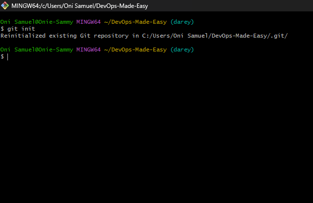
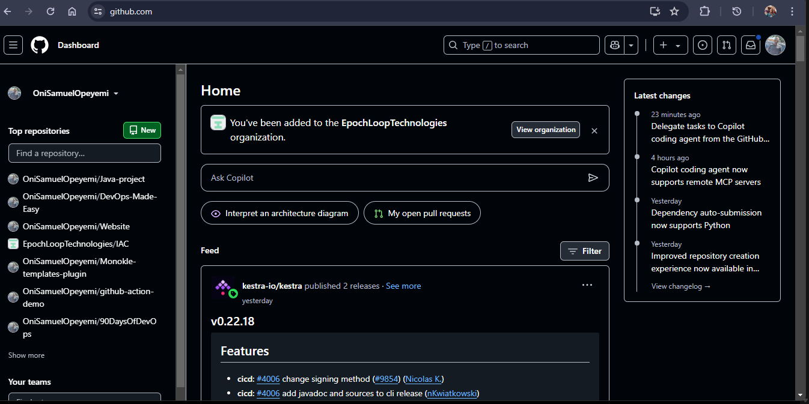
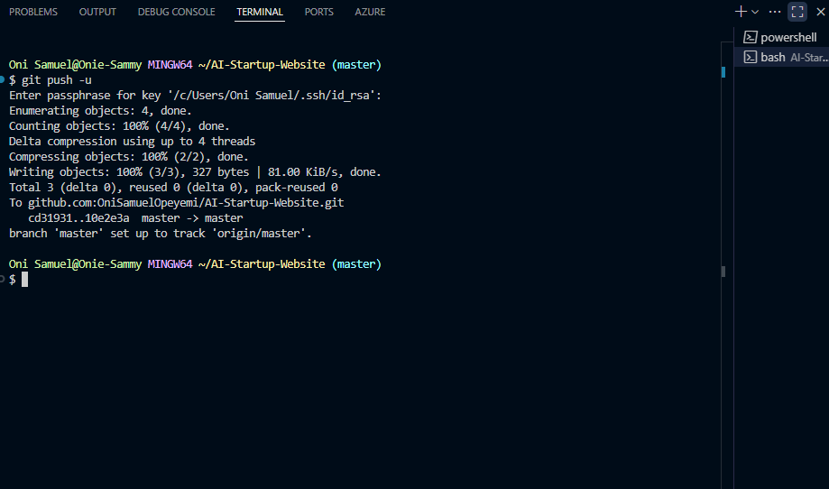
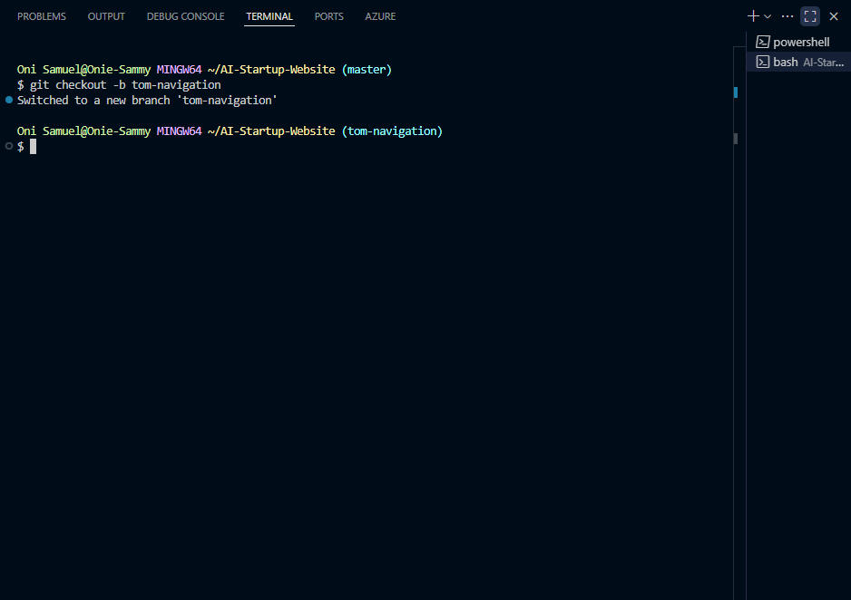

## 📚 Git Documentation & Resources
### Git and GitHub
- Git is a decentralized or distributed version control system used for tracking and managing git repositories.
- git was created by Linus Torvalds 
- Git's de-facto means that it enjoys wide adoption
- Git has three local states which includes;
    - Working Directory 
    - Staging Area 
    - Local repository

- GitHub is a remote git repository hosting service provided by GitHub Inc where software develop can share codes and collaborate. 

Embark on your Git journey with this foundational video directly from the official Git website. In this instructional guide, learners will receive a comprehensive introduction to the basics of Git. The video covers essential concepts such as repository creation, basic commands, branching, and merging, providing a solid understanding of the core functionalities of Git.

By following along with official documentation, learners can trust the accuracy and relevance of the information. This video serves as a crucial starting point for beginners, equipping them with the fundamental skills needed to initiate and manage version control for their projects. Gain confidence in navigating Git's basic features and set the stage for a more in-depth exploration of advanced Git concepts.


---

### 🔗 Essential Git Resources

- 📖 [Official Git Documentation](https://git-scm.com/doc)  
- 🎥 [Git Basics Video (Official)](https://youtu.be/RGOj5yH7evk?si=0U1gepW79UuPkHZx)  
- 🧠 [Git Cheatsheet](https://github.com/OniSamuelOpeyemi/DevOps-Made-Easy/blob/patch-1/Library/Mastering%20Git_%20%20A%20Comprehensive%20Interview%20Guide.pdf)  
- 📘 [Pro Git Book (Free)](https://git-scm.com/book/en/v2)  
- 💡 [Git Branching Simulator](https://learngitbranching.js.org/)  

---

## 🛠️ Common Git Commands and Use Cases

| Command | Description | Use Case |
|--------|-------------|----------|
| `git init` | Initializes a new Git repository | Start version control in a new project |
| ` git config` | To create configuration either locally (--local) or global (--global)|
| `git clone <url>` | Clones a remote repository to your local machine | Work on existing GitHub projects |
| `git status` | Shows the working directory status | See which files are staged/unstaged |
| `git add .` | Stages all changes in the directory | Prepare files for commit |
| `git commit -m "message"` | Records a snapshot of the staged changes | Track meaningful code changes |
| `git push` | Sends commits to the remote repo | Update GitHub with your work |
| `git pull` | Fetches and merges changes from remote | Stay up to date with team progress |
| `git branch` | Lists or creates branches | Manage features or experiments |
| `git checkout -b <branch>` | Creates and switches to a new branch | Start working on a new feature |
| `git merge <branch>` | Merges a branch into the current one | Combine features into main |
| `git log` | Shows commit history | Review project changes | Review what changes were made, when, and by whom |
| `git stash` | Temporarily saves changes | Pause work without committing | Pause work, switch branches, and return later without losing progress |
| `git rebase` | Reapplies commits on top of another base tip | Clean up commit history before merging a feature branch |
| ` git reset` | To undo the change in working directory | Remove a file from staging or rollback to a previous commit |
| ` git remote` | Manages remote repository URLs | Add or inspect GitHub repo linked to local project |
| `git ls-files` | To show files that is being tracked by git | See what Git is currently managing in your repo |
| `git alias` | To create git shortcut | Use git co instead of git checkout to save typing |
|`git --help` | To open a manual page for git commands | Command usage info, e.g., git commit --help |
| `git tag` | To add special marker to commits | Tag a release like v1.0.0 before deploying |

> Some linux command use in git 

| Command | Description | Use Case |
|--------|-------------|----------|
| `cp`| Copy file and directory | Duplicate a config file into another folder before editing |
| `mv` | To move files and rename files | Rename index.html to main.html |
| `mkdir` | To create a directory | Make a folder called project-config for storing YAML files |
| `pwd` | To print working directory | Confirm you are working in the right repo location |
| `rm` | To delete file  | Remove an old log file no longer needed |
| `cat` | To displays the content of files or/and concatenates files together | View contents of file.txt in the terminal |
| `touch` | To create file | Initialize an empty README.md for a new repo |
| `echo` | To print and output | Add text to a file: echo "# Project" > README.md |
| `clear` |To clear the working terminal screen | Clean up clutter before running new commands |
| `nano` , `vim` | Terminal-based text editors | Edit file directly in the terminal |
---

## 🧪 Git Quiz – Test Your Knowledge!

1. What does `git init` do?
2. How do you check the status of your working directory?
3. What’s the difference between `git pull` and `git fetch`?
4. How can you resolve a merge conflict?
5. What does `git stash` allow you to do?

---











🌐 [Live GitHub Repository with index.html](https://github.com/OniSamuelOpeyemi/AI-Startup-Website/blob/master/Darey.io/Git_and_GitHub/index.html)

---

## 👨‍🔬 Practical Lab: Hands-On Git Setup

**Objective 1:** Set up a Git repository locally and push it to GitHub.

### ✅ Steps:
1. Create a new folder and initialize Git:
   ```bash
   mkdir my-devops-project
   cd my-devops-project
   git init
   ```

2. Create a `README.md` file and add content:
   ```bash
   echo "# My DevOps Journey" > README.md
   git add .
   git commit -m "Initial commit"
   ```

3. Create a new GitHub repo and link remote:
   ```bash
   git remote add origin https://github.com/your-username/my-devops-project.git
   git push -u origin master
   ```
---
**Objective 2:** Cloning a repo.

### ✅ Steps:
1. Create a new folder and initialize Git:
   ```bash
   mkdir Demo
   cd Demo
   git init
   ```

2. Clone DevOps-Made-Easy using `git clone ` :
   ```bash
   git clone https://github.com/OniSamuelOpeyemi/DevOps-Made-Easy.git 
   ```

3. Create a feature branch and checkout into it:
   ```bash
   git branch feature
   git checkout feature
   git push -u origin master
   ```

4. Edit the contributor.md file and Add your name:
   ```bash
   nano contributor.md
   git add.  
   git commit 
   ```

5. Push your change and create a pull request:
   ```bash
   git merge
   git push -u origin master
   ```
---

## 🚀 Walkthrough: Real-World Git Workflow

**Scenario:** You're working on a new feature for your project.

### 🔄 Workflow:
```bash
# Switch to a new branch
git checkout -b feature/navbar

# Make changes, then add and commit
git add .
git commit -m "Add navigation bar"

# Push to GitHub
git push -u origin feature/navbar

# Open a Pull Request on GitHub and request a code review
```

> 💬 Tip: Use `git log --oneline --graph` to visually track your commit history.

---

Continue exploring Git with confidence. These hands-on practices and examples are stepping stones to mastering DevOps workflows!